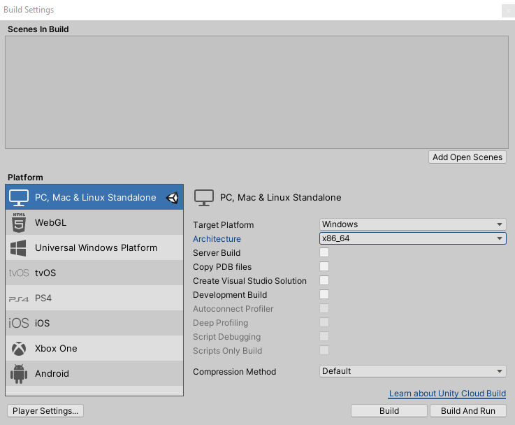
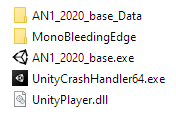

# Exporter son projet Unity

## aka "faire un build"

1. **File → Build Settings**

2. **C'est important d'ajouter une scène dans votre projet** ("Scenes in Build"). A priori pour le projet actuel vous n'avez qu'une seule scène (celle sur laquelle vous travaillez), vous pouvez donc cliquer sur "Add Open Scenes"

   1. L'alternative c'est de glisser votre scène des Assets vers "Scenes in Build"
   2. Si vous n'avez pas de scène de votre buid, l'application exportée affichera juste un écran noir.
      

3. **Pour la version Windows**, choisissez 

   1. Target Platform : Windows

   2. Architecture : x86_64

   3. NE RIEN COCHER D'AUTRE

   4. Appuyer sur Build

   5. Choississez un dossier en dehors du dossier de votre projet, dans lequel sauver le build

   6. Au final, vous aurez quelque chose comme ça

      

      Tous les fichiers sont importants. Ne renommez ni n'effacez aucun fichier pour la remise

      

4. **Pour la version Mac**, idem, avec 

   1. Target Platform : Mac OS X
   2. Sous Windows, le résultat sera un dossier dont le nom se termine par ".app". Ce dossier est (plus ou moins) l'équivalent de nos .exe, et apparaîtra comme une application sur un Mac. Ne pas renommer, ne pas modifier non plus ;)
      

5. Testez toujours le build qui correspond à votre OS (Windows ou Mac) pour vérifier que tout fonctionne bien!
   

6. Si vous voulez le partager avec vos amis ou le monde entier, https://itch.io/ est une excellent plateforme!